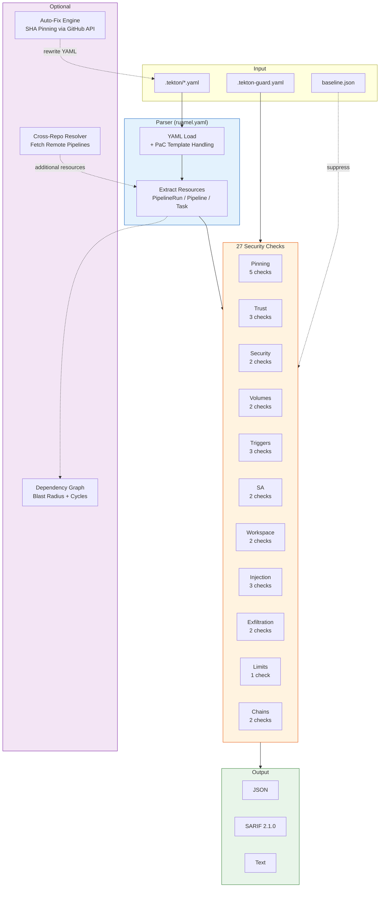

# Architecture

## Components

```
tekton_guard/
├── __main__.py         # python -m tekton_guard
├── cli.py              # CLI entry point, argparse
├── parser.py           # YAML parser with ruamel.yaml, PaC template handling
├── config.py           # Trust lists, check settings
├── checks/             # Security checks (27 checks across 11 categories)
│   ├── __init__.py     # Auto-discovery registry, run_checks()
│   ├── _common.py      # @register_check decorator, shared helpers
│   ├── pinning.py      # TKN-PIN-001..005
│   ├── trust.py        # TKN-TRUST-001..003
│   ├── service_account.py  # TKN-SA-001..002
│   ├── workspace.py    # TKN-WS-001..002
│   ├── result_injection.py # TKN-RES-001..003
│   ├── security.py     # TKN-SEC-001..002
│   ├── volumes.py      # TKN-VOL-001..002
│   ├── triggers.py     # TKN-TRIG-001..003
│   ├── exfiltration.py # TKN-EXFIL-001..002
│   ├── limits.py       # TKN-LIMIT-002
│   └── chains.py       # TKN-CHAIN-001..002
├── formatter.py        # JSON, SARIF, text output
├── resolver.py         # Cross-repo git resolver (--resolve)
├── fixer.py            # Auto-fix engine (--fix, --fix-dry-run)
└── graph.py            # Dependency graph builder (--graph)
```

## Data flow



## Parser

Uses `ruamel.yaml` for YAML parsing with native line number tracking. Handles multi-document YAML and PipelinesAsCode template variables (`{{ }}`) via a parse-then-fallback strategy with UUID-based placeholders.

Parses these Tekton CRD kinds: `PipelineRun`, `Pipeline`, `Task`, `TaskRun`, `StepAction`.

## Checks

Checks are organized as a Python package (`tekton_guard/checks/`) with auto-discovery. Each check module contains one or more check functions decorated with `@register_check`. At import time, the `__init__.py` module scans the package directory and imports all non-underscore modules, which triggers registration.

Each check function receives a `TektonResource` and a `ScannerConfig`, returns a list of finding dicts. The `run_checks()` function iterates all registered checks against all resources, applies severity filtering and skip_checks config, and deduplicates by `(rule_id, file, line, title)`.

## Resolver

The `--resolve` flag enables cross-repo resolution. For each `pipelineRef` or `taskRef` with a `git` resolver, the scanner fetches the remote YAML via GitHub's raw content API (or git clone as fallback) and adds the parsed resources to the scan.

## Fixer

The `--fix` flag enables auto-remediation of fixable findings. Currently supports:
- SHA pinning for mutable git revisions (TKN-PIN-001, TKN-PIN-002, TKN-PIN-005): resolves branch/tag refs to commit SHAs via the GitHub API, then rewrites the YAML in place.
- readOnly for secret workspaces (TKN-WS-001): adds `readOnly: true` to secret-backed workspace bindings.

The `--fix-dry-run` flag previews fixes without modifying files.

## Graph builder

The `--graph` flag generates a JSON dependency graph showing relationships between repos via git resolver references. Nodes represent repos (consumers and pipeline sources), edges represent references. Useful for visualizing blast radius when a shared pipeline repository is compromised.

## Baseline and diff-base

`--baseline` loads a JSON file of previously known findings and suppresses them from the output. Only new findings (not in the baseline) are reported. `--update-baseline` writes the current findings to a baseline file.

`--diff-base` uses `git diff` to identify files changed since a given ref and limits scanning to those files. Combined with `--baseline`, this provides precise CI gating that only fails on newly introduced security issues.
