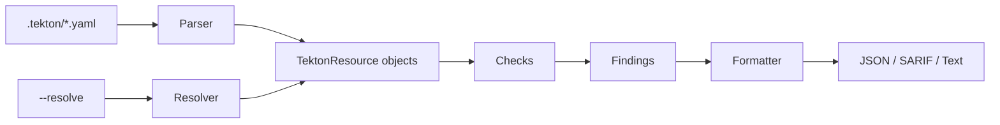

# Architecture

## Components

```
tekton_guard/
├── parser.py      # YAML parser with ruamel.yaml, PaC template handling
├── checks.py      # 16 security checks across 6 categories
├── config.py      # Trust lists, check settings
├── formatter.py   # JSON, SARIF, text output
├── resolver.py    # Cross-repo git resolver (--resolve)
├── cli.py         # CLI entry point, argparse
└── __main__.py    # python -m tekton_guard
```

## Data flow



## Parser

Uses `ruamel.yaml` for YAML parsing with native line number tracking. Handles multi-document YAML and PipelinesAsCode template variables (`{{ }}`) via a parse-then-fallback strategy with UUID-based placeholders.

Parses these Tekton CRD kinds: `PipelineRun`, `Pipeline`, `Task`, `TaskRun`, `StepAction`.

## Checks

Each check function receives a `TektonResource` and a `ScannerConfig`, returns a list of finding dicts. Checks are organized by category (pinning, trust, SA, workspace, result injection, chains). Results are deduplicated by `(rule_id, file, line)`.

## Resolver

The `--resolve` flag enables cross-repo resolution. For each `pipelineRef` or `taskRef` with a `git` resolver, the scanner fetches the remote YAML via GitHub's raw content API (or git clone as fallback) and adds the parsed resources to the scan.
