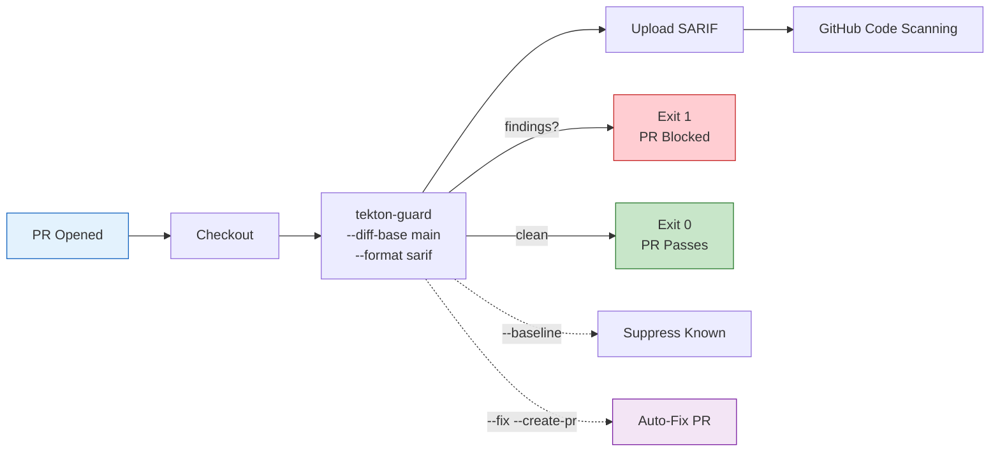

# CI Integration

Integrate tekton-guard into your CI pipeline to gate PRs on Tekton security findings, upload results to GitHub Code Scanning, and auto-fix mutable references.

!!! tip "Quick setup"
    The fastest path: use the reusable GitHub Action. It handles Python setup, SARIF upload, and exit code management in a single step.

    ```yaml
    - uses: ./.github/actions/tekton-guard
      with:
        fail-on: HIGH
        diff-base: ${{ github.event.pull_request.base.sha }}
    ```

## CI Workflow



## GitHub Actions

### Using the Reusable Action

tekton-guard ships a composite GitHub Action at `.github/actions/tekton-guard/action.yml`. This is the recommended integration path.

```yaml
name: Tekton Security Scan
on:
  pull_request:
    paths:
      - '.tekton/**'

jobs:
  tekton-guard:
    runs-on: ubuntu-latest
    steps:
      - uses: actions/checkout@v4
        with:
          fetch-depth: 0  # needed for --diff-base

      - uses: ./.github/actions/tekton-guard
        with:
          fail-on: HIGH
          diff-base: ${{ github.event.pull_request.base.sha }}
```

#### Action Inputs

| Input | Description | Default |
|-------|-------------|---------|
| **`target`** | Path to scan | `.` |
| **`config`** | Path to config file | none |
| **`fail-on`** | Minimum severity to fail on | `HIGH` |
| **`format`** | Output format (`json`, `sarif`, `text`) | `sarif` |
| **`diff-base`** | Only scan files changed since this ref | none |
| **`baseline`** | Path to baseline file for suppression | none |

When `format` is `sarif`, the action automatically uploads results to GitHub Code Scanning via `github/codeql-action/upload-sarif`.

### Manual Workflow (Without Reusable Action)

```yaml
name: Tekton Security Scan
on:
  pull_request:
    paths:
      - '.tekton/**'

jobs:
  tekton-guard:
    runs-on: ubuntu-latest
    steps:
      - uses: actions/checkout@v4
        with:
          fetch-depth: 0

      - uses: actions/setup-python@v5
        with:
          python-version: '3.12'

      - name: Install tekton-guard
        run: pip install git+https://github.com/ugiordan/tekton-guard.git

      - name: Run scan
        run: tekton-guard . --format sarif --output results.sarif --fail-on HIGH

      - name: Upload SARIF
        if: always()
        uses: github/codeql-action/upload-sarif@v3
        with:
          sarif_file: results.sarif
```

### PR-Only Scanning with --diff-base

Scan only files changed in the PR, so you don't fail on pre-existing findings in unchanged files:

```yaml
      - name: Scan changed files only
        run: |
          tekton-guard . \
            --diff-base ${{ github.event.pull_request.base.sha }} \
            --format sarif --output results.sarif \
            --fail-on HIGH
```

### Baseline Suppression

For repos with existing findings that can't be fixed immediately, use a baseline to suppress known issues. Only newly introduced findings will fail CI.

!!! warning "Baseline management"
    Keep your baseline file in version control and regenerate it after fixing findings. A stale baseline silently suppresses findings that should be reported. Review the baseline periodically to ensure it only contains intentionally suppressed findings.

#### Step 1: Generate the baseline

```bash
tekton-guard . --update-baseline .tekton-guard-baseline.json
git add .tekton-guard-baseline.json
git commit -m "chore: add tekton-guard baseline"
```

#### Step 2: Use the baseline in CI

```yaml
      - name: Scan with baseline suppression
        run: |
          tekton-guard . \
            --baseline .tekton-guard-baseline.json \
            --format sarif --output results.sarif \
            --fail-on HIGH
```

New findings not in the baseline will still fail CI. As you fix existing findings, regenerate the baseline to keep it current.

### Combining diff-base and Baseline

For maximum precision, combine both flags. `--diff-base` limits scanning to changed files, and `--baseline` suppresses known findings:

```yaml
      - name: Scan PR changes with baseline
        run: |
          tekton-guard . \
            --diff-base ${{ github.event.pull_request.base.sha }} \
            --baseline .tekton-guard-baseline.json \
            --format sarif --output results.sarif \
            --fail-on HIGH
```

### Auto-Fix in CI

!!! warning "Destructive operation"
    The `--fix` flag modifies YAML files in place. Use `--fix-dry-run` first to preview changes. In CI, always commit fixes to a separate branch or PR.

Run `--fix-dry-run` in CI to show what would be fixed, or use `--fix` in a dedicated workflow to auto-remediate:

```yaml
  tekton-guard-fix:
    runs-on: ubuntu-latest
    if: github.event_name == 'pull_request'
    steps:
      - uses: actions/checkout@v4

      - uses: actions/setup-python@v5
        with:
          python-version: '3.12'

      - name: Install tekton-guard
        run: pip install git+https://github.com/ugiordan/tekton-guard.git

      - name: Auto-fix mutable refs
        env:
          GITHUB_TOKEN: ${{ secrets.GITHUB_TOKEN }}
        run: |
          tekton-guard . --fix --format text
          if [ -n "$(git diff)" ]; then
            git config user.name "github-actions[bot]"
            git config user.email "github-actions[bot]@users.noreply.github.com"
            git add .tekton/
            git commit -m "fix: pin mutable Tekton refs to commit SHAs"
            git push
          fi
```

### With Custom Trust Configuration

```yaml
      - name: Run scan with config
        run: tekton-guard . --config .tekton-guard.yaml --format sarif --output results.sarif
```

### Informational Mode (No Failure)

```yaml
      - name: Run scan (informational)
        run: tekton-guard . --exit-zero --format text
```

## Konflux / Pipelines as Code

tekton-guard can run as a Tekton Task in your Konflux pipeline:

```yaml
apiVersion: tekton.dev/v1
kind: Task
metadata:
  name: tekton-guard-scan
spec:
  params:
    - name: source-dir
      type: string
      default: /workspace/source
  steps:
    - name: scan
      image: python:3.12-slim
      script: |
        pip install git+https://github.com/ugiordan/tekton-guard.git
        tekton-guard $(params.source-dir) --format json --fail-on HIGH
```

## Exit Codes

| Code | Meaning |
|------|---------|
| **`0`** | No findings above threshold |
| **`1`** | Findings above threshold |
| **`2`** | Scanner error (bad path, parse failure) |

Use `--fail-on` to control the threshold and `--exit-zero` to suppress failures entirely.
