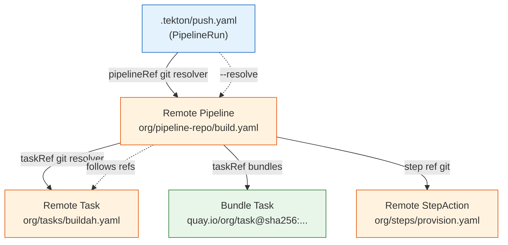

# Cross-Repo Resolution

tekton-guard can follow git resolver URLs to fetch and scan remote Pipeline/Task definitions.

## Resolution Chain



## How it works

Most Tekton PipelineRuns reference external pipelines via git resolver:

```yaml
pipelineRef:
  resolver: git
  params:
    - name: url
      value: https://github.com/org/pipeline-repo.git
    - name: revision
      value: main
    - name: pathInRepo
      value: pipeline/build.yaml
```

With `--resolve`, tekton-guard fetches the referenced Pipeline and scans it too:

```bash
$ tekton-guard /path/to/repo --resolve --format text

Resolved 2 remote resource(s)

[HIGH] TKN-PIN-001: Mutable pipeline revision
  File: .tekton/push.yaml:49

[HIGH] TKN-PIN-002: Mutable task reference (git resolver)
  File: remote:org/pipeline-repo@main/pipeline/build.yaml:161

[MEDIUM] TKN-PIN-004: Mutable step image
  File: remote:org/pipeline-repo@main/pipeline/build.yaml:268
```

## Resolution methods

```bash
# HTTP API fetch (default, fast, no clone needed)
tekton-guard /path/to/repo --resolve

# Git clone (works with private repos if you have credentials)
tekton-guard /path/to/repo --resolve --resolve-method clone
```

## Deduplication

When multiple PipelineRuns reference the same remote Pipeline, findings are deduplicated by `(rule_id, file, line)`. Each finding appears only once.

## Limitations

- Only follows `git` resolver references (not `bundles`, `hub`, or `cluster`)
- HTTP method only works with public GitHub repos
- Clone method requires git credentials for private repos
- Remote findings show paths as `remote:org/repo@ref/path`
