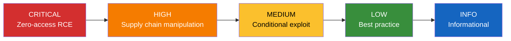

# Understanding Findings

Each tekton-guard finding provides the context you need to assess and remediate the issue.

## Finding Structure

| Field | Description |
|-------|-------------|
| **`rule_id`** | Check identifier (e.g., TKN-PIN-001) |
| **`severity`** | CRITICAL, HIGH, MEDIUM, LOW, or INFO |
| **`title`** | Short description of the issue |
| **`file`** | Path to the affected file |
| **`line_start`** | Line number of the finding |
| **`message`** | Detailed explanation with context |
| **`resource_kind`** | Tekton resource type (PipelineRun, Pipeline, Task, etc.) |
| **`resource_name`** | Name of the affected resource |
| **`cwe`** | Common Weakness Enumeration ID |
| **`remediation`** | How to fix the issue |

## Severity Scale



## Severity Levels

!!! danger "CRITICAL"
    Zero-access remote code execution vectors. Requires immediate action. Examples: CEL expression injection (TKN-TRIG-001), container runtime socket mounts (TKN-VOL-002). An external attacker can execute arbitrary code without any repository access.

!!! warning "HIGH"
    Supply chain risks that allow pipeline or build manipulation by anyone with push access to a referenced repository. Examples: mutable pipeline/task refs (TKN-PIN), untrusted sources (TKN-TRUST), privileged containers (TKN-SEC-001).

!!! note "MEDIUM"
    Security weaknesses that require existing access or specific conditions to exploit. Examples: script interpolation injection (TKN-RES-001), root user (TKN-SEC-002), shared workspaces with untrusted tasks (TKN-WS-002).

!!! tip "LOW"
    Best practice violations and defense-in-depth hardening opportunities. Examples: secret workspaces without readOnly (TKN-WS-001), network tools in scripts (TKN-EXFIL-002), excessive timeouts (TKN-LIMIT-002).

!!! info "INFO"
    Informational findings about missing optional security features. Examples: missing provenance annotations (TKN-CHAIN-002). These don't represent active vulnerabilities but indicate opportunities to improve your security posture.

## Example Finding (JSON)

```json
{
  "rule_id": "TKN-PIN-001",
  "severity": "HIGH",
  "title": "Mutable pipeline revision",
  "file": ".tekton/push.yaml",
  "line_start": 49,
  "message": "PipelineRun 'my-build' references pipeline via git resolver with mutable revision 'main'. A push to main can alter the build pipeline without any commit to this repository.",
  "resource_kind": "PipelineRun",
  "resource_name": "my-build",
  "resolver_type": "git",
  "resolver_url": "https://github.com/org/pipelines.git",
  "current_value": "main",
  "cwe": "CWE-829",
  "remediation": "Pin revision to a 40-character commit SHA."
}
```

!!! example "Text output equivalent"
    ```
    [HIGH] TKN-PIN-001: Mutable pipeline revision
      File: .tekton/push.yaml:49
      PipelineRun 'my-build' references pipeline via git resolver with
      mutable revision 'main'. A push to main can alter the build pipeline
      without any commit to this repository.
      Fix: Pin revision to a 40-character commit SHA.
    ```
