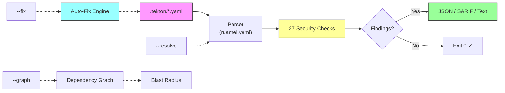

# tekton-guard

**Static security analysis for Tekton pipeline definitions.**

tekton-guard combines 27 security checks with auto-fix capabilities to detect and remediate supply chain risks in Tekton pipelines. It catches what pattern-matching tools can't: transitive reference chains, resolver trust classification, cross-resource data flow, and CEL expression injection.

<div class="grid cards" markdown>

- :material-shield-check: **27 Security Checks** across 11 categories
- :material-wrench: **Auto-Fix Engine** pins mutable refs to SHAs
- :material-source-branch: **CI/CD Integration** with SARIF and baseline suppression
- :material-graph: **Dependency Graph** with blast radius analysis

</div>



## Key Capabilities

- **27 security checks** across 11 categories, from CRITICAL (CEL injection, runtime socket mounts) to INFO (provenance annotations)
- **Auto-fix engine** resolves mutable git refs to pinned SHAs via GitHub API, adds readOnly to secret workspaces
- **CI/CD integration** with GitHub Action, SARIF upload, baseline suppression, and diff-only scanning
- **Cross-repo resolution** follows git resolver URLs to scan remote Pipeline and Task definitions
- **Dependency graph** maps pipeline reference chains with blast radius analysis and cycle detection
- **PaC-aware** false positive suppression for PipelinesAsCode template variables and Konflux patterns

## What It Checks

| Category | Checks | What It Catches |
|----------|--------|-----------------|
| **Pinning** | TKN-PIN-001..005 | Mutable pipeline/task/StepAction refs, unpinned bundles, mutable step images |
| **Trust** | TKN-TRUST-001..003 | Untrusted git/hub sources, unverified cluster tasks |
| **ServiceAccount** | TKN-SA-001..002 | Default or missing SA on PipelineRuns |
| **Workspace** | TKN-WS-001..002 | Secret workspaces without readOnly, shared workspaces with untrusted tasks |
| **Result Injection** | TKN-RES-001..003 | Script/args interpolation injection, PaC parameter taint |
| **Security Context** | TKN-SEC-001..002 | Privileged containers, root user, privilege escalation |
| **Volume Mounts** | TKN-VOL-001..002 | Host path mounts, container runtime socket access (CRITICAL) |
| **Trigger Security** | TKN-TRIG-001..003 | CEL expression injection (CRITICAL), permissive triggers, security task skip |
| **Exfiltration** | TKN-EXFIL-001..002 | Secret access + network tools, network tool detection |
| **Resource Limits** | TKN-LIMIT-002 | Excessive pipeline/task timeouts |
| **Chains Readiness** | TKN-CHAIN-001..002 | Missing provenance annotations on build pipelines |

!!! info "No existing Tekton security scanner"
    Research across open source, commercial tools, policy engines, and the Tekton community confirmed no dedicated Tekton pipeline security scanner existed before tekton-guard. The industry invested in GitHub Actions security (Zizmor, StepSecurity) but nothing equivalent for Tekton, despite it being the CNCF-standard pipeline engine and the foundation of Red Hat's build infrastructure (Konflux, OpenShift Pipelines).

## Quick Start

```bash
# Install
pip install git+https://github.com/ugiordan/tekton-guard.git

# Scan a repository
tekton-guard /path/to/repo --format text

# Auto-fix mutable refs
GITHUB_TOKEN=ghp_... tekton-guard /path/to/repo --fix --format text
```

!!! example "Sample output"
    ```
    Tekton Security Scan: /path/to/repo
    Found 6 issue(s)

    [CRITICAL] TKN-TRIG-001: CEL expression references user-controlled webhook fields
      File: .tekton/pr-check.yaml:12
      PipelineRun has a CEL expression referencing user-controlled webhook
      body fields: body.pull_request.title. An attacker can craft a PR title
      to inject code.
      Fix: Avoid referencing user-controlled body fields in CEL expressions.

    [HIGH] TKN-PIN-001: Mutable pipeline revision
      File: .tekton/push.yaml:49
      PipelineRun references pipeline via git resolver with mutable
      revision 'main' instead of a pinned commit SHA.
      Fix: Pin revision to a 40-character commit SHA.

    [HIGH] TKN-TRUST-001: Pipeline from untrusted source
      File: .tekton/push.yaml:49
      PipelineRun references a pipeline from an untrusted git source.
      Fix: Use a pipeline from a trusted source or update config.
    ```

## Quick Links

### Getting Started
- **[Installation](getting-started/installation.md)** - Install from source in 30 seconds
- **[Quick Start](getting-started/quickstart.md)** - Scan, fix, and gate your first pipeline

### Guides
- **[CI Integration](guides/ci-integration.md)** - GitHub Action, SARIF upload, PR gating
- **[Configuration](guides/configuration.md)** - Trust lists, check tuning, workspace suppression
- **[False Positive Tuning](guides/false-positives.md)** - PaC templates, baseline management
- **[Cross-Repo Resolution](guides/cross-repo.md)** - Follow git resolver references
- **[Understanding Findings](guides/findings.md)** - Severity scale, finding structure, examples

### Reference
- **[Detection Rules](reference/rules.md)** - All 27 checks with severity, CWE, and remediation
- **[CLI Commands](reference/cli.md)** - Full flag reference including --fix, --baseline, --graph
- **[Output Formats](reference/output-formats.md)** - JSON, SARIF 2.1.0, text
