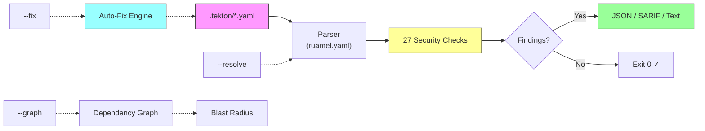

# tekton-guard

**Security scanner for Tekton pipeline definitions.**

tekton-guard catches supply chain risks in Tekton pipelines that pattern-matching tools (semgrep, kube-linter) can't detect: transitive reference chains, resolver trust classification, cross-resource data flow analysis, and CEL expression injection.

## Why tekton-guard?

No dedicated Tekton security scanner existed before this tool. The industry invested heavily in GitHub Actions security (Zizmor, StepSecurity, Scorecard) but nothing equivalent for Tekton, despite it being the CNCF-standard pipeline engine and the foundation of Red Hat's build infrastructure (Konflux, OpenShift Pipelines).

Existing tools fall short:

| Tool | Limitation |
|------|-----------|
| **Semgrep** | Single-file pattern matching, can't follow Pipeline->Task->StepAction chains |
| **kube-linter** | Generic K8s checks, no Tekton semantic understanding |
| **Enterprise Contract** | Validates build outputs/attestations, not pipeline definitions |
| **Tekton Chains** | Signs pipeline results, doesn't validate pipeline definitions |
| **IBM/tekton-lint** | Correctness linter, zero security checks |

tekton-guard fills this gap with 27 security checks across 11 categories, purpose-built for Tekton CRDs.

## Key features

- **27 security checks** across 11 categories, from CRITICAL to INFO severity
- **Auto-fix** (`--fix`): automatically pin mutable git refs to SHAs via GitHub API
- **CI/CD gate** (`--baseline`, `--diff-base`): integrate into GitHub Actions with baseline suppression
- **Cross-repo resolution** (`--resolve`): follow git resolver URLs to scan remote pipelines
- **Dependency graph** (`--graph`): visualize pipeline dependencies and blast radius
- **SARIF output**: upload to GitHub Code Scanning
- **PaC-aware**: suppresses false positives from PipelinesAsCode template variables

## How it works



## Quick example

```bash
$ tekton-guard /path/to/repo --format text

Tekton Security Scan: /path/to/repo
Found 6 issue(s)

[CRITICAL] TKN-TRIG-001: CEL expression references user-controlled webhook fields
  File: .tekton/pr-check.yaml:12
  PipelineRun has a CEL expression referencing user-controlled webhook
  body fields: body.pull_request.title. An attacker can craft a PR title
  to inject code.
  Fix: Avoid referencing user-controlled body fields in CEL expressions.

[HIGH] TKN-PIN-001: Mutable pipeline revision
  File: .tekton/push.yaml:49
  PipelineRun references pipeline via git resolver with mutable
  revision 'main' instead of a pinned commit SHA.
  Fix: Pin revision to a 40-character commit SHA.

[HIGH] TKN-TRUST-001: Pipeline from untrusted source
  File: .tekton/push.yaml:49
  PipelineRun references a pipeline from an untrusted git source.
  Fix: Use a pipeline from a trusted source or update config.

[MEDIUM] TKN-SEC-002: Root user or privilege escalation
  File: .tekton/build-task.yaml:23
  Step 'build' has runAsUser: 0. Running as root increases the blast
  radius of container escapes.
  Fix: Set runAsNonRoot: true in securityContext.

[LOW] TKN-WS-001: Secret workspace without readOnly
  File: .tekton/push.yaml:55
  Workspace backed by secret is not mounted as readOnly.
  Fix: Add 'readOnly: true' to the workspace binding.

[INFO] TKN-CHAIN-002: Missing provenance annotations
  File: .tekton/push.yaml:1
  Build pipeline lacks commit_sha annotation for SLSA provenance.
  Fix: Add build.appstudio.redhat.com/commit_sha annotation.
```

Auto-fix mutable refs in one command:

```bash
$ tekton-guard /path/to/repo --fix --format text
Fixed 3 finding(s): pinned mutable revisions to commit SHAs.
```

## What it checks

| Category | Checks | What it catches |
|----------|--------|-----------------|
| **Pinning** | TKN-PIN-001..005 | Mutable pipeline/task/StepAction refs, unpinned bundles, mutable step images |
| **Trust** | TKN-TRUST-001..003 | Untrusted git/hub sources, unverified cluster tasks |
| **ServiceAccount** | TKN-SA-001..002 | Default or missing SA on PipelineRuns |
| **Workspace** | TKN-WS-001..002 | Secret workspaces without readOnly, shared workspaces with untrusted tasks |
| **Result Injection** | TKN-RES-001..003 | Script/args interpolation injection, PaC parameter taint |
| **Security Context** | TKN-SEC-001..002 | Privileged containers, root user, privilege escalation |
| **Volume Mounts** | TKN-VOL-001..002 | Host path mounts, container runtime socket access (CRITICAL) |
| **Trigger Security** | TKN-TRIG-001..003 | CEL expression injection (CRITICAL), permissive triggers, security task skip |
| **Exfiltration** | TKN-EXFIL-001..002 | Secret access + network tools, network tool detection |
| **Resource Limits** | TKN-LIMIT-002 | Excessive pipeline/task timeouts |
| **Chains Readiness** | TKN-CHAIN-001..002 | Missing provenance annotations on build pipelines |

## Get started

- [Installation](getting-started/installation.md)
- [Quick Start](getting-started/quickstart.md)
- [Detection Rules Reference](reference/rules.md)
- [CI Integration](guides/ci-integration.md)
