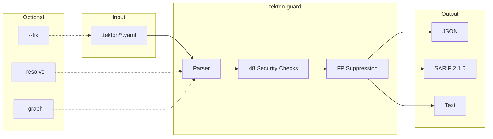

# tekton-guard

Static security analysis for Tekton pipeline definitions

[Get Started](getting-started/installation.md){ .md-button .md-button--primary }
[GitHub](https://github.com/ugiordan/tekton-guard){ .md-button }

---

## Demo


---

## How It Works

tekton-guard parses Tekton CRDs (PipelineRun, Pipeline, Task, StepAction, TriggerTemplate, EventListener) and runs 48 security checks covering supply chain integrity, trust classification, and pipeline logic manipulation.


```mermaid
graph LR
    subgraph Input
        A[".tekton/*.yaml"]
    end

    subgraph "tekton-guard"
        B[Parser] --> C[48 Security Checks]
        C --> D[FP Suppression]
    end

    subgraph Output
        E[JSON]
        F[SARIF 2.1.0]
        G[Text]
    end

    subgraph Optional
        H["--resolve"]
        I["--fix"]
        J["--graph"]
    end

    A --> B
    D --> E
    D --> F
    D --> G
    H -.-> B
    I -.-> A
    J -.-> B
```

**Pipeline:**

1. **Parser** loads Tekton YAML with ruamel.yaml, handles PaC template variables, multi-document files, and 10 CRD kinds
2. **48 Security Checks** across 12 categories detect pinning, trust, injection, privilege, trigger, and logic issues
3. **FP Suppression** filters PaC templates, Konflux patterns, and configurable safe lists
4. **Optional**: `--resolve` follows git resolvers, `--fix` auto-pins mutable refs, `--graph` maps blast radius

---

## Quick Example

```bash
$ tekton-guard .tekton/push.yaml --format text
```

```
Tekton Security Scan: .tekton/push.yaml
Found 4 issue(s)

[HIGH] TKN-PIN-001: Mutable pipeline revision
  File: .tekton/push.yaml:48
  PipelineRun references pipeline with mutable revision 'main'
  Fix: Pin revision to a 40-character commit SHA

[MEDIUM] TKN-RES-003: PaC-sourced parameter taint
  File: .tekton/push.yaml:2
  PipelineRun passes PaC template variables via param 'git-url'
  Fix: Pass through environment variables instead of direct interpolation
```

Generate SARIF for GitHub Code Scanning:

```bash
tekton-guard /path/to/repo --format sarif --output results.sarif
```

---

## Comparison

| Tool | Tekton Semantic | Cross-Resource | Auto-Fix | Supply Chain |
|------|:-:|:-:|:-:|:-:|
| **tekton-guard** | :white_check_mark: | :white_check_mark: | :white_check_mark: | :white_check_mark: |
| Semgrep | :x: | :x: | :x: | :x: |
| kube-linter | :x: | :x: | :x: | :x: |
| Enterprise Contract | :x: | :x: | :x: | :white_check_mark: |
| IBM/tekton-lint | :white_check_mark: | :x: | :x: | :x: |

tekton-guard is the only tool that performs **semantic security analysis** of Tekton pipeline definitions with cross-resource correlation, auto-fix, and supply chain integrity checks.

---

## Features

<div class="grid cards" markdown>

-   :material-link-lock:{ .lg .middle } **Supply Chain Integrity**

    ---

    Validates pinning across Pipeline -> Task -> StepAction chains. Detects mutable refs, untrusted sources, and unpinned bundles at every level.

-   :material-auto-fix:{ .lg .middle } **Auto-Fix Engine**

    ---

    Resolves mutable git refs to SHA via GitHub API. Pins container images to digests via OCI registry API. Atomic file writes.

-   :material-shield-alert:{ .lg .middle } **Pipeline Logic Analysis**

    ---

    Detects security tasks not in finally blocks, onError:continue bypasses, TOCTOU via parallel workspace access, and parameterized step images.

-   :material-source-branch:{ .lg .middle } **Cross-Repo Resolution**

    ---

    Follows git resolver URLs to fetch and scan remote Pipeline/Task definitions. Maps dependency graphs with blast radius analysis.

</div>

---

## What Gets Detected

48 checks across 12 categories:

| Category | Checks | Examples |
|----------|--------|---------|
| **Pinning** | TKN-PIN-001..005 | Mutable pipeline/task/StepAction refs, unpinned bundles |
| **Trust** | TKN-TRUST-001..006 | Untrusted sources, HTTP resolver without digest, shared namespace |
| **ServiceAccount** | TKN-SA-001..002 | Default or missing SA |
| **Workspace** | TKN-WS-001..002 | Secret without readOnly, shared with untrusted tasks |
| **Result Injection** | TKN-RES-001..003 | Script injection, PaC parameter taint |
| **Security Context** | TKN-SEC-001..002 | Privileged containers, root user |
| **Volume Mounts** | TKN-VOL-001..002 | Host path, container runtime socket |
| **Trigger Security** | TKN-TRIG-001..009 | CEL injection, TriggerTemplate, EventListener, PaC Repository |
| **Exfiltration** | TKN-EXFIL-001..002 | Secret access + network tools |
| **Resource Limits** | TKN-LIMIT-001..002 | Missing resources, excessive timeouts |
| **Chains Readiness** | TKN-CHAIN-001..006 | VerificationPolicy regex, result poisoning, SBOM |
| **Pipeline Logic** | TKN-LOGIC-001..007 | Finally block, onError, parameterized images, TOCTOU |

See [Detection Rules](reference/rules.md) for the full reference.

---

## Next Steps

<div class="grid cards" markdown>

-   [Installation Guide](getting-started/installation.md)
-   [Quick Start Tutorial](getting-started/quickstart.md)
-   [CI Integration](guides/ci-integration.md)
-   [Detection Rules Reference](reference/rules.md)

</div>
