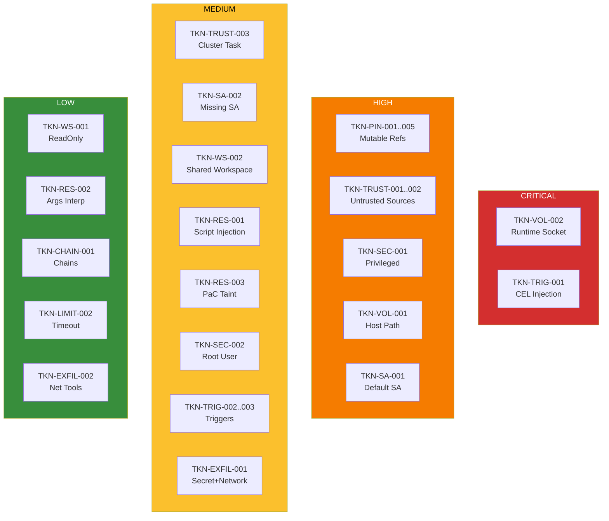

# Detection Rules

tekton-guard includes 27 security checks across 11 categories. Each check has a unique rule ID, severity level, and CWE mapping.

## Check Categories Overview

## Pinning (TKN-PIN)

### TKN-PIN-001: Mutable pipeline revision
- **Severity**: HIGH
- **CWE**: CWE-829 (Inclusion of Functionality from Untrusted Control Sphere)
- **Applies to**: PipelineRun
- **Detect**: `pipelineRef.resolver: git` with `revision` param that is not a 40-character hex SHA
- **Risk**: A push to the referenced branch can alter the build pipeline without any commit to this repository, breaking SLSA Build L3.
- **Fix**: Pin revision to a 40-character commit SHA. Use Renovate or Mintmaker to keep SHA-pinned refs up to date. Auto-fixable with `--fix`.

### TKN-PIN-002: Mutable task reference (git resolver)
- **Severity**: HIGH
- **CWE**: CWE-829
- **Applies to**: Pipeline
- **Detect**: `taskRef.resolver: git` with non-SHA revision in Pipeline task definitions
- **Risk**: An attacker with push access to the source repo can inject malicious task code.
- **Fix**: Pin the task's git revision to a 40-character commit SHA. Auto-fixable with `--fix`.

### TKN-PIN-003: Unpinned task bundle
- **Severity**: HIGH
- **CWE**: CWE-829
- **Applies to**: Pipeline
- **Detect**: `taskRef.resolver: bundles` where bundle param lacks `@sha256:` digest
- **Risk**: Bundle tags are mutable and can be overwritten with malicious content.
- **Fix**: Pin the bundle reference to include `@sha256:<digest>`.

### TKN-PIN-004: Mutable step image
- **Severity**: MEDIUM
- **CWE**: CWE-829
- **Applies to**: Task, StepAction, Pipeline (inline taskSpec)
- **Detect**: `steps[].image` or `sidecars[].image` without `@sha256:` digest
- **Risk**: Image tags are mutable and can be overwritten to inject malicious code into the build.
- **Fix**: Pin the image to a digest: `image: <registry>/<image>@sha256:<digest>`

### TKN-PIN-005: Mutable StepAction reference
- **Severity**: HIGH
- **CWE**: CWE-829
- **Applies to**: Task (steps with `ref`)
- **Detect**: Step-level `ref.resolver: git` with mutable revision
- **Risk**: The StepAction code can be changed without any commit to this repository.
- **Fix**: Pin the StepAction's git revision to a 40-character commit SHA. Auto-fixable with `--fix`.

## Trust (TKN-TRUST)

### TKN-TRUST-001: Pipeline from untrusted source
- **Severity**: HIGH
- **CWE**: CWE-829
- **Applies to**: PipelineRun
- **Detect**: `pipelineRef.resolver: git` with URL not in `trusted_git_sources`
- **Risk**: Untrusted pipeline sources can execute arbitrary code in the build environment.
- **Fix**: Use a pipeline from a trusted source or add the source to `trusted_git_sources` in the config file.

### TKN-TRUST-002: Task from untrusted source
- **Severity**: HIGH
- **CWE**: CWE-829
- **Applies to**: Pipeline
- **Detect**: `taskRef.resolver: git|hub` where the source URL (or hub catalog) is not in the trusted sources list
- **Risk**: Untrusted tasks can exfiltrate secrets or inject malicious code.
- **Fix**: Use tasks from trusted sources or add the source to `trusted_git_sources` in the config file.

### TKN-TRUST-003: Unverified cluster task reference
- **Severity**: MEDIUM
- **CWE**: CWE-829
- **Applies to**: Pipeline
- **Detect**: `taskRef.name` without resolver (cluster-local reference, mutable, unversioned)
- **Risk**: Cluster tasks are mutable: anyone with write access to the namespace can replace them.
- **Fix**: Use a bundle or git resolver with a pinned reference instead of cluster-local task names.

## ServiceAccount (TKN-SA)

### TKN-SA-001: Default ServiceAccount
- **Severity**: HIGH
- **CWE**: CWE-269 (Improper Privilege Management)
- **Applies to**: PipelineRun, TaskRun
- **Detect**: `serviceAccountName: default` on PipelineRun/TaskRun
- **Risk**: The default SA may have broad permissions that violate least-privilege. Build workloads should use a dedicated SA with minimal RBAC.
- **Fix**: Create and use a dedicated ServiceAccount with only the permissions required for this pipeline.

### TKN-SA-002: Missing ServiceAccount
- **Severity**: MEDIUM
- **CWE**: CWE-269
- **Applies to**: PipelineRun, TaskRun
- **Detect**: PipelineRun/TaskRun with no `serviceAccountName` set
- **Risk**: The workload inherits the namespace default ServiceAccount, which may have unintended permissions.
- **Fix**: Explicitly set `serviceAccountName` in `taskRunTemplate` (PipelineRun) or `spec` (TaskRun).

## Workspace (TKN-WS)

### TKN-WS-001: Secret workspace without readOnly
- **Severity**: LOW
- **CWE**: CWE-732 (Incorrect Permission Assignment for Critical Resource)
- **Applies to**: PipelineRun, TaskRun
- **Detect**: Workspace backed by secret without `readOnly: true`
- **Risk**: Tasks could potentially modify the secret content.
- **Fix**: Add `readOnly: true` to the workspace binding for secret-backed workspaces. Auto-fixable with `--fix`.

### TKN-WS-002: Shared workspace with untrusted tasks
- **Severity**: MEDIUM
- **CWE**: CWE-732
- **Applies to**: Pipeline
- **Detect**: Multiple tasks sharing a workspace where at least one task is from an untrusted source (git or hub resolver with untrusted URL)
- **Risk**: Untrusted tasks could read secrets or tamper with data from other tasks via the shared workspace.
- **Fix**: Isolate untrusted tasks with separate workspaces, or use Tekton Trusted Artifacts for verified data passing.

## Result Injection (TKN-RES)

### TKN-RES-001: Parameter/result interpolation in script block
- **Severity**: MEDIUM
- **CWE**: CWE-94 (Improper Control of Generation of Code)
- **Applies to**: Task, StepAction, Pipeline (inline taskSpec)
- **Detect**: `$(params.*)` or `$(tasks.*.results.*)` used inside `script:` blocks
- **Risk**: The Tekton equivalent of GitHub Actions `${{ }}` injection. Untrusted input interpolated into scripts enables arbitrary code execution.
- **Fix**: Pass values as environment variables instead of interpolating in scripts. Use `env` with `value: $(params.name)` and reference `$ENV_VAR` in the script.

### TKN-RES-002: Parameter interpolation in command args
- **Severity**: LOW
- **CWE**: CWE-78 (Improper Neutralization of Special Elements used in an OS Command)
- **Applies to**: Task, StepAction, Pipeline (inline taskSpec)
- **Detect**: `$(params.*)` used in `args:` or `command:` arrays
- **Risk**: While safer than script injection, this can still enable command injection if values are untrusted.
- **Fix**: Validate parameter values before use, or pass them as environment variables.

### TKN-RES-003: PaC-sourced parameter taint
- **Severity**: MEDIUM
- **CWE**: CWE-94
- **Applies to**: PipelineRun
- **Detect**: PipelineRun params that contain PipelinesAsCode template variables from user-controlled webhook data (`source_url`, `repo_url`, `revision`, `source_branch`, `target_branch`, `sender`, `pull_request_number`, `body`)
- **Risk**: These values come from webhook data and may reach script interpolation points in referenced tasks. An attacker can craft a PR with a malicious branch name or PR body to inject code.
- **Fix**: Validate PaC-sourced parameter values before using them in scripts. Pass through environment variables instead of direct interpolation.

## Security Context (TKN-SEC)

### TKN-SEC-001: Privileged container
- **Severity**: HIGH
- **CWE**: CWE-250 (Execution with Unnecessary Privileges)
- **Applies to**: Task, StepAction, Pipeline (inline taskSpec)
- **Detect**: `securityContext.privileged: true` on step or sidecar containers
- **Risk**: A compromised container with privileged access can escape the sandbox and access the host node.
- **Fix**: Remove `privileged: true` from `securityContext`. If elevated access is needed, use specific capabilities instead.

### TKN-SEC-002: Root user or privilege escalation
- **Severity**: MEDIUM
- **CWE**: CWE-250
- **Applies to**: Task, StepAction, Pipeline (inline taskSpec)
- **Detect**: `securityContext.runAsUser: 0` or `securityContext.allowPrivilegeEscalation: true` on step or sidecar containers
- **Risk**: Running as root increases the blast radius of container escapes.
- **Fix**: Set `runAsNonRoot: true` and `allowPrivilegeEscalation: false` in `securityContext`.

## Volume Mounts (TKN-VOL)

### TKN-VOL-001: Host path volume mount
- **Severity**: HIGH
- **CWE**: CWE-284 (Improper Access Control)
- **Applies to**: Task, StepAction, Pipeline (inline taskSpec)
- **Detect**: `volumes[].hostPath` entries (excluding container runtime socket paths, which are caught by VOL-002)
- **Risk**: Host path volumes give direct access to the node filesystem, enabling container escape and data exfiltration.
- **Fix**: Remove the `hostPath` volume. Use `emptyDir` or PVC-backed volumes instead.

### TKN-VOL-002: Container runtime socket mount
- **Severity**: CRITICAL
- **CWE**: CWE-284
- **Applies to**: Task, StepAction, Pipeline (inline taskSpec)
- **Detect**: `hostPath` volumes mounting container runtime sockets: `/var/run/docker.sock`, `/run/containerd/containerd.sock`, `/var/run/crio/crio.sock`, `/run/docker.sock`
- **Risk**: Grants full control over the container runtime, enabling arbitrary container creation, image manipulation, and node compromise.
- **Fix**: Remove the runtime socket mount. Use rootless build tools (buildah, kaniko) that don't require Docker socket access.

## Trigger Security (TKN-TRIG)

### TKN-TRIG-001: CEL expression injection
- **Severity**: CRITICAL
- **CWE**: CWE-94
- **Applies to**: PipelineRun
- **Detect**: `pipelinesascode.tekton.dev/on-cel-expression` annotation that references user-controlled webhook body fields (`body.pull_request.title`, `body.pull_request.body`, `body.pull_request.head.ref`, `body.head_commit.message`, `body.commits`, `body.comment.body`, `body.sender`)
- **Risk**: An attacker can craft a PR title, branch name, or commit message to inject code into the CEL expression. This is the Tekton equivalent of GitHub Actions `pull_request_target` injection.
- **Fix**: Avoid referencing user-controlled body fields in CEL expressions. Use event type and target branch filtering only.

### TKN-TRIG-002: Overly permissive trigger
- **Severity**: MEDIUM
- **CWE**: CWE-284
- **Applies to**: PipelineRun
- **Detect**: Push triggers without `target_branch` filter in CEL expressions, or comment triggers (`on-comment`) without `on-target-branch` restriction
- **Risk**: Any push to any branch will trigger this pipeline, or comment triggers accept comments on all branches.
- **Fix**: Add `target_branch` filter to CEL expression for push triggers. Add `pipelinesascode.tekton.dev/on-target-branch` annotation for comment triggers.

### TKN-TRIG-003: Conditional skip of security tasks
- **Severity**: MEDIUM
- **CWE**: CWE-693 (Protection Mechanism Failure)
- **Applies to**: Pipeline
- **Detect**: Security-related tasks (matching patterns: scan, sign, verify, attest, cosign, enterprise-contract, sast, clair, clamav) with `when` expressions that reference `$(params.*)` or `$(tasks.*)` inputs
- **Risk**: If the parameter controlling the `when` expression is user-controlled, an attacker could craft input to skip security checks.
- **Fix**: Remove conditional `when` expressions from security-critical tasks, or validate that the `when` input is not user-controlled.

## Exfiltration (TKN-EXFIL)

### TKN-EXFIL-001: Task with secret access and network-capable scripts
- **Severity**: MEDIUM
- **CWE**: CWE-200 (Exposure of Sensitive Information)
- **Applies to**: Task, StepAction
- **Detect**: Task has access to secrets (via workspace or `secretKeyRef` env vars) and uses network tools in scripts: `curl`, `wget`, `nc`, `ncat`, `socat`, `telnet`, `openssl s_client`, `dig`, `nslookup`, or `/dev/tcp/`
- **Risk**: A compromised or malicious task could exfiltrate secrets to external endpoints.
- **Fix**: Minimize secret exposure. Use dedicated tasks for secret access with no network tools. Apply NetworkPolicy to restrict egress.

### TKN-EXFIL-002: Network tool in script
- **Severity**: LOW
- **CWE**: CWE-200
- **Applies to**: Task, StepAction, Pipeline (inline taskSpec)
- **Detect**: Scripts containing network tools: `curl`, `wget`, `nc`, `ncat`, `socat`, `telnet`, `openssl s_client`, `dig`, `nslookup`, or `/dev/tcp/`
- **Risk**: These tools could be used for data exfiltration, even without direct secret access.
- **Fix**: Review whether network access is necessary. Consider using NetworkPolicy to restrict egress.

## Resource Limits (TKN-LIMIT)

### TKN-LIMIT-002: Excessive timeout
- **Severity**: LOW
- **CWE**: CWE-400 (Uncontrolled Resource Consumption)
- **Applies to**: PipelineRun
- **Detect**: `spec.timeouts.pipeline` exceeding 4 hours, or `spec.timeouts.tasks` exceeding 2 hours
- **Risk**: Long-running pipelines increase the attack window for compromised tasks.
- **Fix**: Reduce pipeline timeout to 4 hours or less, task timeout to 2 hours or less.

## Chains Readiness (TKN-CHAIN)

### TKN-CHAIN-001: Build pipeline without Chains annotations
- **Severity**: LOW
- **CWE**: CWE-345 (Insufficient Verification of Data Authenticity)
- **Applies to**: PipelineRun (with `pipelines.appstudio.openshift.io/type: build` label)
- **Detect**: Build-type PipelineRun without `chains.tekton.dev` or Konflux/AppStudio annotations. Suppressed for PipelineRuns with Konflux labels (`appstudio.openshift.io/application` or `appstudio.openshift.io/component`).
- **Risk**: Tekton Chains may not generate provenance attestations for this build.
- **Fix**: Ensure the referenced pipeline produces `IMAGE_URL` and `IMAGE_DIGEST` results for Tekton Chains to sign.

### TKN-CHAIN-002: Missing provenance annotations
- **Severity**: INFO
- **CWE**: CWE-345
- **Applies to**: PipelineRun (with `pipelines.appstudio.openshift.io/type: build` label)
- **Detect**: Build PipelineRun lacking `build.appstudio.redhat.com/commit_sha` annotation
- **Risk**: Without this annotation, Tekton Chains cannot correlate builds to source commits for SLSA provenance.
- **Fix**: Add `build.appstudio.redhat.com/commit_sha` annotation with the source commit SHA.
