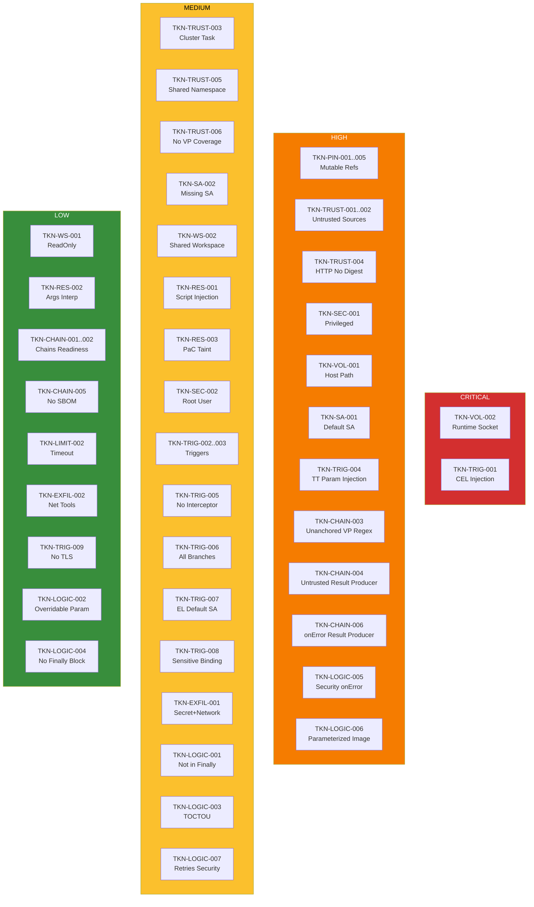

# Detection Rules

tekton-guard includes 48 security checks across 12 categories. Each check has a unique rule ID, severity level, and CWE mapping.

## Check Categories Overview

---

## Pinning (TKN-PIN)

!!! danger "Supply chain integrity"
    Mutable references allow pipeline tampering without any commit to your repository. Pin all references to immutable SHAs or digests. These checks enforce SLSA Build L3 requirements.

### TKN-PIN-001: Mutable pipeline revision
- **Severity**: HIGH
- **CWE**: CWE-829 (Inclusion of Functionality from Untrusted Control Sphere)
- **Applies to**: PipelineRun
- **Detect**: `pipelineRef.resolver: git` with `revision` param that is not a 40-character hex SHA
- **Risk**: A push to the referenced branch can alter the build pipeline without any commit to this repository, breaking SLSA Build L3.
- **Fix**: Pin revision to a 40-character commit SHA. Use Renovate or Mintmaker to keep SHA-pinned refs up to date. Auto-fixable with `--fix`.

### TKN-PIN-002: Mutable task reference (git resolver)
- **Severity**: HIGH
- **CWE**: CWE-829
- **Applies to**: Pipeline
- **Detect**: `taskRef.resolver: git` with non-SHA revision in Pipeline task definitions
- **Risk**: An attacker with push access to the source repo can inject malicious task code.
- **Fix**: Pin the task's git revision to a 40-character commit SHA. Auto-fixable with `--fix`.

### TKN-PIN-003: Unpinned task bundle
- **Severity**: HIGH
- **CWE**: CWE-829
- **Applies to**: Pipeline
- **Detect**: `taskRef.resolver: bundles` where bundle param lacks `@sha256:` digest
- **Risk**: Bundle tags are mutable and can be overwritten with malicious content.
- **Fix**: Pin the bundle reference to include `@sha256:<digest>`.

### TKN-PIN-004: Mutable step image
- **Severity**: MEDIUM
- **CWE**: CWE-829
- **Applies to**: Task, StepAction, Pipeline (inline taskSpec)
- **Detect**: `steps[].image` or `sidecars[].image` without `@sha256:` digest
- **Risk**: Image tags are mutable and can be overwritten to inject malicious code into the build.
- **Fix**: Pin the image to a digest: `image: <registry>/<image>@sha256:<digest>`

### TKN-PIN-005: Mutable StepAction reference
- **Severity**: HIGH
- **CWE**: CWE-829
- **Applies to**: Task (steps with `ref`)
- **Detect**: Step-level `ref.resolver: git` with mutable revision
- **Risk**: The StepAction code can be changed without any commit to this repository.
- **Fix**: Pin the StepAction's git revision to a 40-character commit SHA. Auto-fixable with `--fix`.

---

## Trust (TKN-TRUST)

!!! warning "Source verification"
    Untrusted pipeline and task sources can execute arbitrary code in your build environment. Configure `trusted_git_sources` in your config to define which organizations are authorized.

### TKN-TRUST-001: Pipeline from untrusted source
- **Severity**: HIGH
- **CWE**: CWE-829
- **Applies to**: PipelineRun
- **Detect**: `pipelineRef.resolver: git` with URL not in `trusted_git_sources`
- **Risk**: Untrusted pipeline sources can execute arbitrary code in the build environment.
- **Fix**: Use a pipeline from a trusted source or add the source to `trusted_git_sources` in the config file.

### TKN-TRUST-002: Task from untrusted source
- **Severity**: HIGH
- **CWE**: CWE-829
- **Applies to**: Pipeline
- **Detect**: `taskRef.resolver: git|hub` where the source URL (or hub catalog) is not in the trusted sources list
- **Risk**: Untrusted tasks can exfiltrate secrets or inject malicious code.
- **Fix**: Use tasks from trusted sources or add the source to `trusted_git_sources` in the config file.

### TKN-TRUST-003: Unverified cluster task reference
- **Severity**: MEDIUM
- **CWE**: CWE-829
- **Applies to**: Pipeline
- **Detect**: `taskRef.name` without resolver (cluster-local reference, mutable, unversioned)
- **Risk**: Cluster tasks are mutable: anyone with write access to the namespace can replace them.
- **Fix**: Use a bundle or git resolver with a pinned reference instead of cluster-local task names.

### TKN-TRUST-004: HTTP resolver without digest
- **Severity**: HIGH
- **CWE**: CWE-829 (Inclusion of Functionality from Untrusted Control Sphere)
- **Applies to**: PipelineRun, Pipeline
- **Detect**: `pipelineRef` or `taskRef` using `resolver: http` without a `digest` param
- **Risk**: Without integrity verification, a man-in-the-middle or compromised server can inject malicious task/pipeline definitions.
- **Fix**: Add a digest param to the HTTP resolver: `digest: sha256:<hash>`

### TKN-TRUST-005: Cluster resolver in shared namespace
- **Severity**: MEDIUM
- **CWE**: CWE-829 (Inclusion of Functionality from Untrusted Control Sphere)
- **Applies to**: Pipeline
- **Detect**: `taskRef.resolver: cluster` where the `namespace` param is in the `shared_namespaces` config (default: `tekton-pipelines`, `openshift-pipelines`)
- **Risk**: Any user with Task create permission in the shared namespace can replace the referenced task.
- **Fix**: Use a dedicated namespace for cluster-resolver tasks, or switch to bundle/git resolver with pinning.

### TKN-TRUST-006: Bundle without VerificationPolicy coverage
- **Severity**: MEDIUM
- **CWE**: CWE-345 (Insufficient Verification of Data Authenticity)
- **Applies to**: Pipeline (correlation check, requires VerificationPolicy resources in scan scope)
- **Detect**: `taskRef.resolver: bundles` where the bundle image does not match any `resourcePattern` in scanned VerificationPolicy resources
- **Risk**: Bundle content is not signature-verified before execution.
- **Fix**: Create a VerificationPolicy with a `resourcePattern` covering this bundle's registry.

---

## ServiceAccount (TKN-SA)

!!! warning "Privilege management"
    Build workloads should use dedicated ServiceAccounts with minimal RBAC. The default SA often has broad permissions that violate least-privilege.

### TKN-SA-001: Default ServiceAccount
- **Severity**: HIGH
- **CWE**: CWE-269 (Improper Privilege Management)
- **Applies to**: PipelineRun, TaskRun
- **Detect**: `serviceAccountName: default` on PipelineRun/TaskRun
- **Risk**: The default SA may have broad permissions that violate least-privilege. Build workloads should use a dedicated SA with minimal RBAC.
- **Fix**: Create and use a dedicated ServiceAccount with only the permissions required for this pipeline.

### TKN-SA-002: Missing ServiceAccount
- **Severity**: MEDIUM
- **CWE**: CWE-269
- **Applies to**: PipelineRun, TaskRun
- **Detect**: PipelineRun/TaskRun with no `serviceAccountName` set
- **Risk**: The workload inherits the namespace default ServiceAccount, which may have unintended permissions.
- **Fix**: Explicitly set `serviceAccountName` in `taskRunTemplate` (PipelineRun) or `spec` (TaskRun).

---

## Workspace (TKN-WS)

!!! note "Data isolation"
    Workspaces are the primary data-sharing mechanism in Tekton pipelines. Improper workspace configuration can expose secrets or allow untrusted tasks to tamper with build data.

### TKN-WS-001: Secret workspace without readOnly
- **Severity**: LOW
- **CWE**: CWE-732 (Incorrect Permission Assignment for Critical Resource)
- **Applies to**: PipelineRun, TaskRun
- **Detect**: Workspace backed by secret without `readOnly: true`
- **Risk**: Tasks could potentially modify the secret content.
- **Fix**: Add `readOnly: true` to the workspace binding for secret-backed workspaces. Auto-fixable with `--fix`.

### TKN-WS-002: Shared workspace with untrusted tasks
- **Severity**: MEDIUM
- **CWE**: CWE-732
- **Applies to**: Pipeline
- **Detect**: Multiple tasks sharing a workspace where at least one task is from an untrusted source (git or hub resolver with untrusted URL)
- **Risk**: Untrusted tasks could read secrets or tamper with data from other tasks via the shared workspace.
- **Fix**: Isolate untrusted tasks with separate workspaces, or use Tekton Trusted Artifacts for verified data passing.

---

## Result Injection (TKN-RES)

!!! note "Code injection prevention"
    Parameter and result interpolation in Tekton scripts is the equivalent of GitHub Actions `${{ }}` injection. Untrusted input interpolated into scripts enables arbitrary code execution.

### TKN-RES-001: Parameter/result interpolation in script block
- **Severity**: MEDIUM
- **CWE**: CWE-94 (Improper Control of Generation of Code)
- **Applies to**: Task, StepAction, Pipeline (inline taskSpec)
- **Detect**: `$(params.*)` or `$(tasks.*.results.*)` used inside `script:` blocks
- **Risk**: The Tekton equivalent of GitHub Actions `${{ }}` injection. Untrusted input interpolated into scripts enables arbitrary code execution.
- **Fix**: Pass values as environment variables instead of interpolating in scripts. Use `env` with `value: $(params.name)` and reference `$ENV_VAR` in the script.

### TKN-RES-002: Parameter interpolation in command args
- **Severity**: LOW
- **CWE**: CWE-78 (Improper Neutralization of Special Elements used in an OS Command)
- **Applies to**: Task, StepAction, Pipeline (inline taskSpec)
- **Detect**: `$(params.*)` used in `args:` or `command:` arrays
- **Risk**: While safer than script injection, this can still enable command injection if values are untrusted.
- **Fix**: Validate parameter values before use, or pass them as environment variables.

### TKN-RES-003: PaC-sourced parameter taint
- **Severity**: MEDIUM
- **CWE**: CWE-94
- **Applies to**: PipelineRun
- **Detect**: PipelineRun params that contain PipelinesAsCode template variables from user-controlled webhook data (`source_url`, `repo_url`, `revision`, `source_branch`, `target_branch`, `sender`, `pull_request_number`, `body`)
- **Risk**: These values come from webhook data and may reach script interpolation points in referenced tasks. An attacker can craft a PR with a malicious branch name or PR body to inject code.
- **Fix**: Validate PaC-sourced parameter values before using them in scripts. Pass through environment variables instead of direct interpolation.

---

## Security Context (TKN-SEC)

!!! warning "Container isolation"
    Privileged containers and root execution weaken the container sandbox. A compromised container with elevated privileges can escape to the host node.

### TKN-SEC-001: Privileged container
- **Severity**: HIGH
- **CWE**: CWE-250 (Execution with Unnecessary Privileges)
- **Applies to**: Task, StepAction, Pipeline (inline taskSpec)
- **Detect**: `securityContext.privileged: true` on step or sidecar containers
- **Risk**: A compromised container with privileged access can escape the sandbox and access the host node.
- **Fix**: Remove `privileged: true` from `securityContext`. If elevated access is needed, use specific capabilities instead.

### TKN-SEC-002: Root user or privilege escalation
- **Severity**: MEDIUM
- **CWE**: CWE-250
- **Applies to**: Task, StepAction, Pipeline (inline taskSpec)
- **Detect**: `securityContext.runAsUser: 0` or `securityContext.allowPrivilegeEscalation: true` on step or sidecar containers
- **Risk**: Running as root increases the blast radius of container escapes.
- **Fix**: Set `runAsNonRoot: true` and `allowPrivilegeEscalation: false` in `securityContext`.

---

## Volume Mounts (TKN-VOL)

!!! danger "Host access"
    Host path volumes and container runtime socket mounts are the most severe findings. They grant direct access to the node filesystem or full control over the container runtime.

### TKN-VOL-001: Host path volume mount
- **Severity**: HIGH
- **CWE**: CWE-284 (Improper Access Control)
- **Applies to**: Task, StepAction, Pipeline (inline taskSpec)
- **Detect**: `volumes[].hostPath` entries (excluding container runtime socket paths, which are caught by VOL-002)
- **Risk**: Host path volumes give direct access to the node filesystem, enabling container escape and data exfiltration.
- **Fix**: Remove the `hostPath` volume. Use `emptyDir` or PVC-backed volumes instead.

### TKN-VOL-002: Container runtime socket mount
- **Severity**: CRITICAL
- **CWE**: CWE-284
- **Applies to**: Task, StepAction, Pipeline (inline taskSpec)
- **Detect**: `hostPath` volumes mounting container runtime sockets: `/var/run/docker.sock`, `/run/containerd/containerd.sock`, `/var/run/crio/crio.sock`, `/run/docker.sock`
- **Risk**: Grants full control over the container runtime, enabling arbitrary container creation, image manipulation, and node compromise.
- **Fix**: Remove the runtime socket mount. Use rootless build tools (buildah, kaniko) that don't require Docker socket access.

---

## Trigger Security (TKN-TRIG)

!!! danger "Remote code execution"
    CEL expression injection (TKN-TRIG-001) is a CRITICAL finding. An attacker can craft a PR title, branch name, or commit message to inject code into the CEL expression evaluator. This is the Tekton equivalent of GitHub Actions `pull_request_target` injection.

### TKN-TRIG-001: CEL expression injection
- **Severity**: CRITICAL
- **CWE**: CWE-94
- **Applies to**: PipelineRun
- **Detect**: `pipelinesascode.tekton.dev/on-cel-expression` annotation that references user-controlled webhook body fields (`body.pull_request.title`, `body.pull_request.body`, `body.pull_request.head.ref`, `body.head_commit.message`, `body.commits`, `body.comment.body`, `body.sender`)
- **Risk**: An attacker can craft a PR title, branch name, or commit message to inject code into the CEL expression. This is the Tekton equivalent of GitHub Actions `pull_request_target` injection.
- **Fix**: Avoid referencing user-controlled body fields in CEL expressions. Use event type and target branch filtering only.

### TKN-TRIG-002: Overly permissive trigger
- **Severity**: MEDIUM
- **CWE**: CWE-284
- **Applies to**: PipelineRun
- **Detect**: Push triggers without `target_branch` filter in CEL expressions, or comment triggers (`on-comment`) without `on-target-branch` restriction
- **Risk**: Any push to any branch will trigger this pipeline, or comment triggers accept comments on all branches.
- **Fix**: Add `target_branch` filter to CEL expression for push triggers. Add `pipelinesascode.tekton.dev/on-target-branch` annotation for comment triggers.

### TKN-TRIG-003: Conditional skip of security tasks
- **Severity**: MEDIUM
- **CWE**: CWE-693 (Protection Mechanism Failure)
- **Applies to**: Pipeline
- **Detect**: Security-related tasks (matching patterns: scan, sign, verify, attest, cosign, enterprise-contract, sast, clair, clamav) with `when` expressions that reference `$(params.*)` or `$(tasks.*)` inputs
- **Risk**: If the parameter controlling the `when` expression is user-controlled, an attacker could craft input to skip security checks.
- **Fix**: Remove conditional `when` expressions from security-critical tasks, or validate that the `when` input is not user-controlled.

### TKN-TRIG-004: TriggerTemplate param injection
- **Severity**: HIGH
- **CWE**: CWE-94 (Improper Control of Generation of Code)
- **Applies to**: TriggerTemplate
- **Detect**: `$(tt.params.*)` interpolations in `resourcetemplates`. These values flow from webhook body via TriggerBindings.
- **Risk**: Webhook body fields passed through TriggerBindings and interpolated in TriggerTemplates may reach task script blocks, enabling code injection.
- **Fix**: Validate trigger params before passing to PipelineRun. Avoid interpolating webhook body fields directly.

### TKN-TRIG-005: EventListener without interceptor
- **Severity**: MEDIUM
- **CWE**: CWE-284 (Improper Access Control)
- **Applies to**: EventListener
- **Detect**: EventListener trigger entries with no `interceptors` configured
- **Risk**: Raw webhook payloads reach TriggerBindings without signature verification or filtering.
- **Fix**: Add a webhook interceptor (GitHub, GitLab, CEL, or Bitbucket) to validate payload authenticity.

### TKN-TRIG-006: PaC Repository allows all branches
- **Severity**: MEDIUM
- **CWE**: CWE-284 (Improper Access Control)
- **Applies to**: Repository (PipelinesAsCode)
- **Detect**: PaC Repository CR with no `incoming` webhook restrictions
- **Risk**: Any branch push or PR can trigger pipeline execution. PipelineRun-level CEL filters may provide additional restrictions, but the Repository CR itself is open.
- **Fix**: Add `incoming` rules to restrict which branches and events trigger pipelines.

### TKN-TRIG-007: EventListener with default/missing SA
- **Severity**: MEDIUM
- **CWE**: CWE-269 (Improper Privilege Management)
- **Applies to**: EventListener
- **Detect**: EventListener with `serviceAccountName: default` or no `serviceAccountName` set
- **Risk**: The EventListener SA can create PipelineRuns and should use a dedicated SA with minimal permissions.
- **Fix**: Set `serviceAccountName` to a dedicated SA with only PipelineRun create permission.

### TKN-TRIG-008: TriggerBinding extracts sensitive webhook fields
- **Severity**: MEDIUM
- **CWE**: CWE-200 (Exposure of Sensitive Information)
- **Applies to**: TriggerBinding
- **Detect**: TriggerBinding params whose name or value matches sensitive patterns (secret, token, password, credential, key, auth)
- **Risk**: Webhook body fields passed through TriggerBinding are logged in PipelineRun params and may be visible in cluster events.
- **Fix**: Use Tekton Interceptors to extract and validate sensitive fields before they reach TriggerBinding params.

### TKN-TRIG-009: EventListener without TLS
- **Severity**: LOW
- **CWE**: CWE-319 (Cleartext Transmission of Sensitive Information)
- **Applies to**: EventListener
- **Detect**: EventListener without TLS configuration in `spec.resources.kubernetesResource.spec.tls`
- **Risk**: Webhook payloads including authentication tokens are transmitted in plaintext.
- **Fix**: Configure TLS on the EventListener or terminate TLS at the ingress/route level.

---

## Exfiltration (TKN-EXFIL)

!!! note "Data loss prevention"
    These checks detect combinations of secret access and network capabilities that could enable data exfiltration from the build environment.

### TKN-EXFIL-001: Task with secret access and network-capable scripts
- **Severity**: MEDIUM
- **CWE**: CWE-200 (Exposure of Sensitive Information)
- **Applies to**: Task, StepAction
- **Detect**: Task has access to secrets (via workspace or `secretKeyRef` env vars) and uses network tools in scripts: `curl`, `wget`, `nc`, `ncat`, `socat`, `telnet`, `openssl s_client`, `dig`, `nslookup`, or `/dev/tcp/`
- **Risk**: A compromised or malicious task could exfiltrate secrets to external endpoints.
- **Fix**: Minimize secret exposure. Use dedicated tasks for secret access with no network tools. Apply NetworkPolicy to restrict egress.

### TKN-EXFIL-002: Network tool in script
- **Severity**: LOW
- **CWE**: CWE-200
- **Applies to**: Task, StepAction, Pipeline (inline taskSpec)
- **Detect**: Scripts containing network tools: `curl`, `wget`, `nc`, `ncat`, `socat`, `telnet`, `openssl s_client`, `dig`, `nslookup`, or `/dev/tcp/`
- **Risk**: These tools could be used for data exfiltration, even without direct secret access.
- **Fix**: Review whether network access is necessary. Consider using NetworkPolicy to restrict egress.

---

## Resource Limits (TKN-LIMIT)

!!! tip "Attack window reduction"
    Long-running pipelines increase the window of opportunity for compromised tasks. Set reasonable timeouts to limit exposure.

### TKN-LIMIT-002: Excessive timeout
- **Severity**: LOW
- **CWE**: CWE-400 (Uncontrolled Resource Consumption)
- **Applies to**: PipelineRun
- **Detect**: `spec.timeouts.pipeline` exceeding 4 hours, or `spec.timeouts.tasks` exceeding 2 hours
- **Risk**: Long-running pipelines increase the attack window for compromised tasks.
- **Fix**: Reduce pipeline timeout to 4 hours or less, task timeout to 2 hours or less.

---

## Chains Readiness (TKN-CHAIN)

!!! tip "SLSA provenance"
    Tekton Chains generates SLSA provenance attestations for builds. These checks ensure your pipelines are configured correctly for Chains to produce and sign provenance data.

### TKN-CHAIN-001: Build pipeline without Chains annotations
- **Severity**: LOW
- **CWE**: CWE-345 (Insufficient Verification of Data Authenticity)
- **Applies to**: PipelineRun (with `pipelines.appstudio.openshift.io/type: build` label)
- **Detect**: Build-type PipelineRun without `chains.tekton.dev` or Konflux/AppStudio annotations. Suppressed for PipelineRuns with Konflux labels (`appstudio.openshift.io/application` or `appstudio.openshift.io/component`).
- **Risk**: Tekton Chains may not generate provenance attestations for this build.
- **Fix**: Ensure the referenced pipeline produces `IMAGE_URL` and `IMAGE_DIGEST` results for Tekton Chains to sign.

### TKN-CHAIN-002: Missing provenance annotations
- **Severity**: INFO
- **CWE**: CWE-345
- **Applies to**: PipelineRun (with `pipelines.appstudio.openshift.io/type: build` label)
- **Detect**: Build PipelineRun lacking `build.appstudio.redhat.com/commit_sha` annotation
- **Risk**: Without this annotation, Tekton Chains cannot correlate builds to source commits for SLSA provenance.
- **Fix**: Add `build.appstudio.redhat.com/commit_sha` annotation with the source commit SHA.

### TKN-CHAIN-003: VerificationPolicy with unanchored regex
- **Severity**: HIGH
- **CWE**: CWE-185 (Incorrect Regular Expression)
- **Applies to**: VerificationPolicy
- **Detect**: `spec.resources[].resourcePattern` without `^` and `$` anchors
- **Risk**: Unanchored patterns can match unintended resources (related to CVE-2026-25542).
- **Fix**: Anchor the pattern with `^` and `$`: `^<pattern>$`

### TKN-CHAIN-004: Chains-consumed result from untrusted task
- **Severity**: HIGH
- **CWE**: CWE-345 (Insufficient Verification of Data Authenticity)
- **Applies to**: Pipeline
- **Detect**: Pipeline tasks whose names suggest they produce build/image results (containing "build", "push", "image", "container") but are sourced from untrusted git or hub resolvers
- **Risk**: A compromised task can poison Chains attestation by producing fraudulent IMAGE_URL/IMAGE_DIGEST results.
- **Fix**: Use trusted, pinned sources for all tasks that produce IMAGE_URL/IMAGE_DIGEST results.

!!! note "Overlap with TKN-TRUST-002"
    This check may fire alongside TKN-TRUST-002 on the same task. This is expected: TRUST-002 flags the untrusted source, CHAIN-004 flags the supply chain attestation poisoning risk. They represent different risk dimensions.

### TKN-CHAIN-005: Build pipeline without SBOM task
- **Severity**: LOW
- **CWE**: CWE-1059 (Insufficient Technical Documentation)
- **Applies to**: Pipeline (with `pipelines.appstudio.openshift.io/type: build` label)
- **Detect**: Build pipeline without a task matching SBOM patterns (sbom, syft, cyclonedx, spdx). Patterns are configurable via `security_task_patterns`.
- **Risk**: Missing software bill of materials reduces supply chain transparency.
- **Fix**: Add an SBOM generation task to the build pipeline.

### TKN-CHAIN-006: Chains result producer with onError continue
- **Severity**: HIGH
- **CWE**: CWE-345 (Insufficient Verification of Data Authenticity)
- **Applies to**: Pipeline
- **Detect**: Pipeline tasks that produce Chains-consumed results (IMAGE_URL, IMAGE_DIGEST, CHAINS-GIT_URL, CHAINS-GIT_COMMIT) with `onError: continue`
- **Risk**: If the task fails, Chains may sign invalid or incomplete attestation data.
- **Fix**: Remove `onError: continue` from tasks that produce IMAGE_URL/IMAGE_DIGEST results.

---

## Pipeline Logic (TKN-LOGIC)

!!! warning "Pipeline execution integrity"
    These checks detect logic flaws in pipeline structure that can undermine security controls: tasks that can be skipped, bypassed, or executed with attacker-controlled parameters. A well-structured pipeline ensures security tasks always run and cannot be influenced by untrusted input.

### TKN-LOGIC-001: Security task not in finally block
- **Severity**: MEDIUM
- **CWE**: CWE-693 (Protection Mechanism Failure)
- **Applies to**: Pipeline
- **Detect**: Tasks matching `security_task_patterns` (scan, sign, verify, attest, cosign, enterprise-contract, sast, clair, clamav, sbom, syft, cyclonedx) placed in `spec.tasks` instead of `spec.finally`
- **Risk**: If any preceding task fails, the security task will be skipped entirely. Tasks in `spec.finally` always run regardless of pipeline success or failure.
- **Fix**: Move security tasks (scan, sign, verify, attest) to the `finally` block.

### TKN-LOGIC-002: Overridable security-relevant param default
- **Severity**: LOW
- **CWE**: CWE-1188 (Initialization of a Resource with an Insecure Default)
- **Applies to**: Task, StepAction
- **Detect**: Task/StepAction params whose name or default value contains security keywords (privileged, tls-verify, skip, insecure, allow-all, no-verify, disable-auth, unsafe)
- **Risk**: A PipelineRun caller can override the default to a less secure value.
- **Fix**: Use hardcoded values instead of params for security-critical flags.

!!! info "Disabled by default"
    TKN-LOGIC-002 is skipped by default (`skip_checks` includes it) because it can be noisy. Enable it by removing it from `skip_checks` in your config.

### TKN-LOGIC-003: TOCTOU via parallel workspace access
- **Severity**: MEDIUM
- **CWE**: CWE-367 (Time-of-check Time-of-use Race Condition)
- **Applies to**: Pipeline
- **Detect**: Two tasks sharing a workspace that can run in parallel (no `runAfter` dependency, direct or transitive) where at least one task is from an untrusted source
- **Risk**: An untrusted task could modify workspace data while another task reads it, creating a time-of-check-time-of-use race condition.
- **Fix**: Add a `runAfter` dependency between tasks sharing a workspace, or use separate workspaces.

### TKN-LOGIC-004: Pipeline without finally block
- **Severity**: LOW
- **CWE**: CWE-390 (Detection of Error Condition Without Action)
- **Applies to**: Pipeline
- **Detect**: Pipeline with tasks but no `spec.finally` block
- **Risk**: No cleanup, reporting, or error handling runs on pipeline failure.
- **Fix**: Add a `finally` block with at minimum a status-reporting task.

### TKN-LOGIC-005: Security task with onError continue
- **Severity**: HIGH
- **CWE**: CWE-390 (Detection of Error Condition Without Action)
- **Applies to**: Pipeline
- **Detect**: Security tasks (matching `security_task_patterns`) with `onError: continue`
- **Risk**: Security task failures will be silently ignored, allowing compromised builds to pass without detection.
- **Fix**: Remove `onError: continue` from security tasks. Failures should block the pipeline.

### TKN-LOGIC-006: Parameterized step image
- **Severity**: HIGH
- **CWE**: CWE-94 (Improper Control of Generation of Code)
- **Applies to**: Task, StepAction
- **Detect**: Step or sidecar `image` containing `$(params.*)` or `$(inputs.*)` interpolation
- **Risk**: A PipelineRun caller can override this parameter to run arbitrary code in the build environment.
- **Fix**: Hardcode step images or validate the parameter against an allowlist.

### TKN-LOGIC-007: Retries on security task
- **Severity**: MEDIUM
- **CWE**: CWE-693 (Protection Mechanism Failure)
- **Applies to**: Pipeline
- **Detect**: Security tasks (matching `security_task_patterns`) with `retries >= 1`
- **Risk**: Retrying security scans can mask intermittent failures or allow flaky security checks to eventually pass.
- **Fix**: Remove retries from security tasks. Security checks should fail deterministically.
